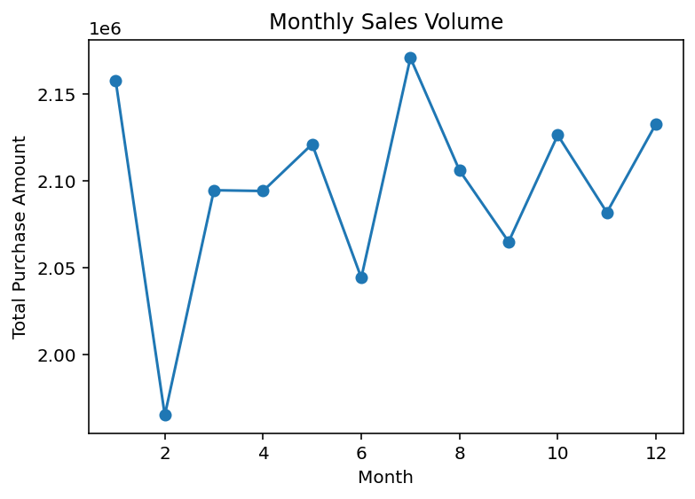
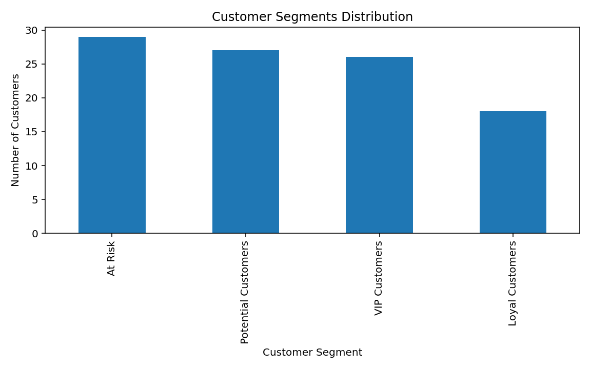

📊 E-Ticaret Analitiği ve Müşteri Zekası Projesi
## 📊 Dashboard

Proje kapsamında geliştirilen Power BI dashboardu satış performansını ve müşteri davranışlarını görselleştirmektedir.

## 📈 Monthly Sales Trend

Aylık satış hacmini incelemek amacıyla satış trendi analizi yapılmıştır.

## 👥 Customer Segmentation (RFM)

RFM analizi kullanılarak müşteriler davranışlarına göre farklı segmentlere ayrılmıştır.

Bu projede e-ticaret işlem verileri üzerinde uçtan uca bir veri analizi çalışması gerçekleştirilmiştir. Yaklaşık 50.000 işlemden oluşan bir veri seti kullanılarak müşteri davranışları, satış dağılımları ve müşteri değerine yönelik analizler yapılmıştır.

Projenin temel amacı; satış performansını incelemek, müşteri davranışlarını anlamak ve veri analizi yöntemleri kullanarak müşteri segmentleri oluşturmaktır. Bu süreçte veri analizi pipeline’ının farklı aşamaları uygulanmıştır.

🎯 Proje Amaçları

Bu proje kapsamında aşağıdaki sorulara cevap aranmıştır:

Hangi ürün kategorileri daha fazla gelir üretmektedir?

Satışlar ülkelere göre nasıl dağılım göstermektedir?

Müşteriler en çok hangi ödeme yöntemlerini kullanmaktadır?

Satışlar zaman içerisinde nasıl değişmektedir?

Müşteriler davranışlarına göre hangi segmentlere ayrılabilir?

📂 Veri Seti

Projede kullanılan veri seti yaklaşık 50.000 e-ticaret işlem kaydı içermektedir.

Veri setinde bulunan temel değişkenler:

Transaction_ID

User_Name

Age

Country

Product_Category

Purchase_Amount

Payment_Method

Transaction_Date

Veri seti analiz sürecinde hem Python ortamında hem de SQL veritabanı içerisinde kullanılmıştır.

⚙️ Proje Süreci

Bu proje veri analizi sürecinin farklı aşamalarını içermektedir.

1️⃣ Veri Keşfi ve Temizleme (EDA)

Python kullanılarak veri setinin genel yapısı incelenmiştir.

Bu aşamada:

Veri setinin boyutu ve değişken yapısı incelenmiştir

Eksik veri kontrolleri yapılmıştır

Temel istatistiksel özetler çıkarılmıştır

Kategori bazlı satış dağılımları analiz edilmiştir

Ülkelere göre satış dağılımları incelenmiştir

Ödeme yöntemlerinin dağılımı analiz edilmiştir

Aylık satış trendleri görselleştirilmiştir

Bu analizler Pandas, Matplotlib ve Seaborn kütüphaneleri kullanılarak gerçekleştirilmiştir.

2️⃣ Verinin SQL Veritabanına Aktarılması

Veri seti Python kullanılarak SQLite veritabanına aktarılmıştır.

Bu süreçte:

CSV veri seti SQL veritabanına yüklenmiştir

Veri tablosu oluşturulmuştur

SQL sorguları ile veri analizi yapılmıştır

3️⃣ SQL ile Veri Analizi

SQL kullanılarak satış verileri üzerinde çeşitli analizler gerçekleştirilmiştir.

Örneğin:

Ülkelere göre toplam işlem sayısı

Ürün kategorilerine göre toplam satış gelirleri

Ödeme yöntemlerine göre ortalama harcama

Aylara göre toplam satış hacmi

Yaş gruplarına göre ortalama harcama analizi

Bu analizler sayesinde satış verisinin farklı boyutları SQL üzerinden incelenmiştir.

4️⃣ Makine Öğrenmesi Denemeleri

Proje kapsamında bazı temel makine öğrenmesi yaklaşımları da denenmiştir.

Bu aşamada:

Purchase Amount tahmini için regresyon modeli kurulmuştur

High Spender müşterileri belirlemek için sınıflandırma modeli denenmiştir

Model sonuçları veri setindeki değişkenlerin hedef değişkeni güçlü şekilde açıklamadığını göstermiştir. Bu durum veri özelliklerinin model performansı üzerindeki etkisini gözlemleme açısından önemli bir deneyim olmuştur.

5️⃣ Müşteri Segmentasyonu

Müşteri davranışlarını analiz etmek amacıyla K-Means kümeleme algoritması kullanılmıştır.

Bu analiz ile müşteriler harcama davranışlarına göre farklı segmentlere ayrılmıştır.

6️⃣ Customer Lifetime Value (CLV) Analizi

Müşteri başına toplam harcama hesaplanarak müşterilerin oluşturduğu toplam değer analiz edilmiştir.

Bu analiz sayesinde yüksek değerli müşteriler belirlenmiştir.

7️⃣ Customer Loyalty Analizi

Müşteri başına gerçekleştirilen işlem sayısı incelenerek müşteri sadakati analiz edilmiştir.

Bu analiz sayesinde:

sık alışveriş yapan müşteriler

düşük işlem sayısına sahip müşteriler

arasında farklılıklar incelenmiştir.

8️⃣ RFM Analizi

Müşteri davranışlarını daha detaylı incelemek amacıyla RFM analizi uygulanmıştır.

Bu analiz üç temel metriğe dayanır:

Recency → müşterinin son alışveriş zamanı

Frequency → alışveriş sıklığı

Monetary → toplam harcama miktarı

Bu metrikler kullanılarak müşteriler aşağıdaki segmentlere ayrılmıştır:

VIP Customers

Loyal Customers

Potential Customers

At Risk Customers

9️⃣ Power BI Dashboard

Analiz sonuçlarını görselleştirmek amacıyla Power BI dashboard geliştirilmiştir.

Dashboard içerisinde şu görseller bulunmaktadır:

Ürün kategorilerine göre satış dağılımı

Ülkelere göre satış dağılımı

Ödeme yöntemlerinin dağılımı

Aylık satış trendi

Toplam gelir

Ortalama harcama

Toplam işlem sayısı

Bu dashboard satış performansını ve müşteri davranışlarını görsel olarak incelemeye imkan sağlamaktadır.

📈 Temel Bulgular

Analiz sonuçlarına göre:

Sports ve Toys kategorileri en yüksek satış gelirine sahip kategoriler arasında yer almıştır.

Satışların ülkeler arasında görece dengeli dağıldığı gözlemlenmiştir.

Temmuz ayı satış hacminin en yüksek olduğu aylardan biri olarak öne çıkmıştır.

Yüksek işlem sıklığına sahip müşterilerin toplam satış gelirine önemli katkı sağladığı görülmüştür.

RFM analizi müşteri sadakati ile gelir üretimi arasında güçlü bir ilişki olduğunu göstermektedir.

🧰 Kullanılan Teknolojiler

Python
Pandas
Matplotlib
Seaborn
Scikit-learn
SQL
SQLite
Power BI

📊 Sonuç

Bu proje sayesinde veri analizi sürecini veri keşfi, veri sorgulama, müşteri segmentasyonu, model denemeleri ve dashboard geliştirme adımlarıyla uçtan uca uygulama fırsatı elde edilmiştir.

Proje, e-ticaret verisi üzerinde müşteri davranışlarını anlamak ve satış performansını analiz etmek için veri analizi yöntemlerinin nasıl kullanılabileceğini göstermektedir.

