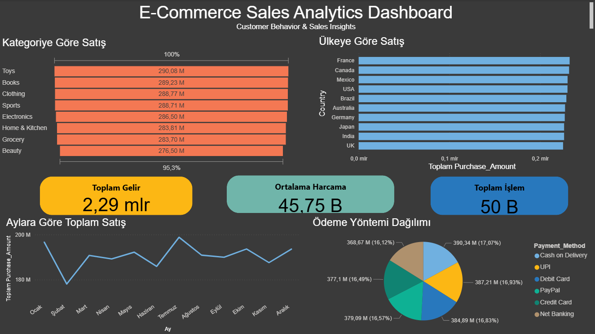

# E-Commerce Analytics & Customer Intelligence Project

Bu proje, e-ticaret işlem verileri üzerinde uçtan uca veri analizi yapmak amacıyla geliştirilmiştir. 
Projede Python, SQL, Power BI ve makine öğrenmesi yöntemleri kullanılarak müşteri davranışları, satış trendleri ve müşteri segmentleri incelenmiştir.

## Proje Amacı

Bu projenin amacı, e-ticaret verisi üzerinden şu sorulara cevap aramaktır:

- Hangi ürün kategorileri daha fazla gelir üretiyor?
- Hangi ülkelerde satış daha yüksek?
- Müşteriler en çok hangi ödeme yöntemlerini kullanıyor?
- Satışlar zaman içinde nasıl değişiyor?
- Yüksek değerli ve sadık müşteriler kimler?
- Müşteriler davranışlarına göre hangi segmentlere ayrılabilir?

## Veri Seti

Proje, 50.000 satırlık sentetik bir e-ticaret işlem veri seti üzerinde geliştirilmiştir.

Kullanılan temel değişkenler:

- Transaction_ID
- User_Name
- Age
- Country
- Product_Category
- Purchase_Amount
- Payment_Method
- Transaction_Date

## Kullanılan Teknolojiler

- Python
- Pandas
- Matplotlib
- Seaborn
- Scikit-learn
- SQLite
- SQL
- Power BI

## Analizler

Bu projede şu analizler gerçekleştirilmiştir:

- Exploratory Data Analysis (EDA)
- Customer Segmentation (K-Means)
- Customer Lifetime Value (CLV)
- Customer Loyalty Analysis
- RFM Analysis
- Machine Learning Modelleri
- SQL veri analizi
- Power BI Dashboard geliştirme

## Dashboard

Power BI üzerinde geliştirilen dashboard aşağıdaki metrikleri içermektedir:

- Ürün kategorisine göre satışlar
- Ülkelere göre satış dağılımı
- Aylık satış trendleri
- Ödeme yöntemi dağılımı
- Toplam gelir
- Ortalama harcama
- Toplam işlem sayısı

## Sonuç

Bu proje, e-ticaret verileri üzerinde müşteri analitiği, satış analizi, segmentasyon ve dashboard geliştirme süreçlerini uçtan uca göstermektedir.

## Author

Halil Dönmez  
Statistics Student | Data Science Enthusiast
